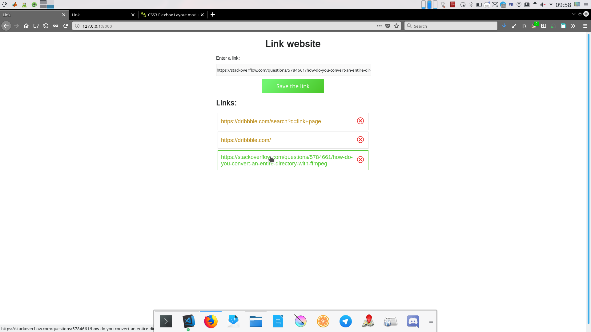

Link
====

Web app in django to quickly save link.



install
-------
``` 
    cd link 
    pip install -r requirements.txt
    python3 manage.py makemigrations webApp
    python3 manage.py migrate
```

Launch
------

```
    python3 manage.py runserver
```
